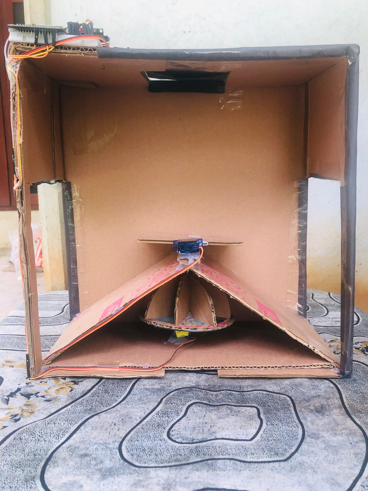
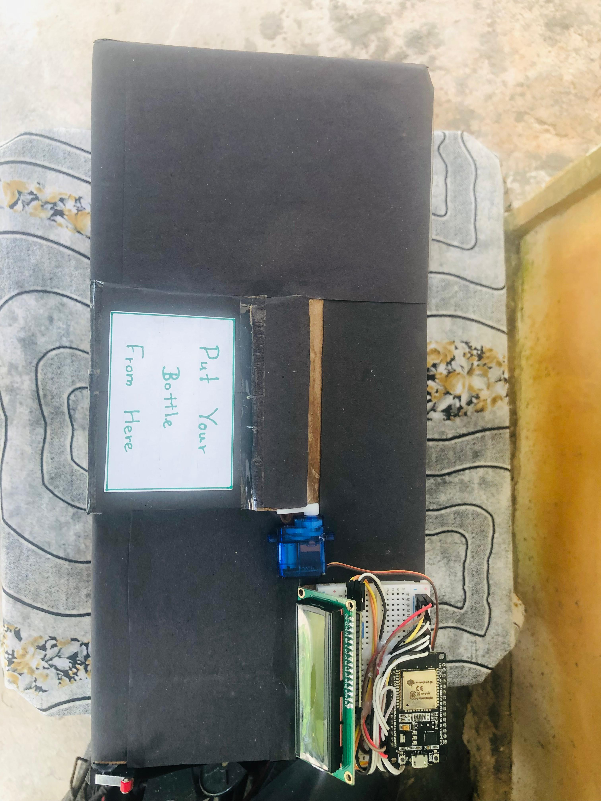
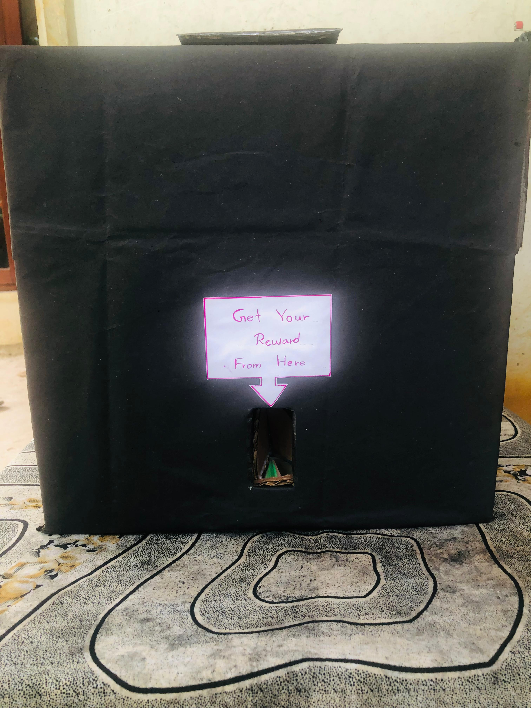
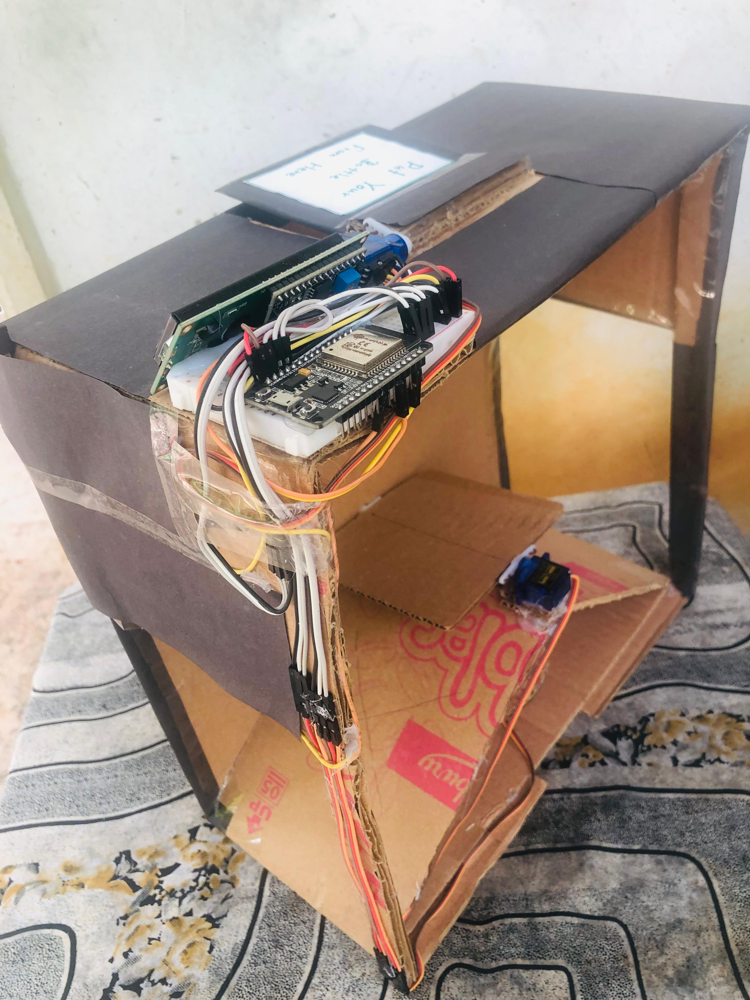

# ♻️ Smart Plastic Bottle Redemption System

A Smart AI-based system that detects and collects plastic bottles using **Python**, **Arduino**, and **Computer Vision**. Designed to promote environmental sustainability by enabling automatic plastic bottle identification and redemption.

---

## 📌 Project Summary

This system uses a **Python-based AI model** and **Arduino microcontroller** to automate the process of detecting and collecting plastic bottles. The project is ideal for smart waste management and eco-friendly recycling initiatives.

---

## 🚀 Features

- 🎯 Real-time plastic bottle detection via webcam
- 🔌 Serial communication between Python and Arduino
- ⚙️ Automatic motor control for collecting bottles
- 🧠 Lightweight MobileNetV2 model
- 🖥 Developed and tested using Visual Studio Code

---

## 🧰 Tech Stack

| Component       | Technology               |
|----------------|---------------------------|
| 🧠 AI Model     | MobileNetV2 (Keras/TensorFlow) |
| 👁️ Vision       | OpenCV                    |
| 🖥 Programming  | Python 3                  |
| 🔌 Microcontrol | Arduino UNO / ESP32       |
| 🔧 IDE          | VS Code + Arduino IDE     |
| 🔁 Communication| Serial via PySerial       |

---

## 🛠 Hardware Requirements

- Arduino UNO or ESP32
- USB cable (for Arduino connection)
- Servo motor or DC motor
- Plastic bottle (for testing)
- Webcam
- Jumper wires, power supply

---

## 💻 Software Requirements

- Python 3.x
- Arduino IDE
- VS Code
- Required Python libraries:
  - `opencv-python`
  - `tensorflow`
  - `keras`
  - `pyserial`
  - `numpy`

Install all dependencies using:

```bash
pip install -r requirements.txt

```
## 🔍 How It Works

1. The webcam captures a live video stream.
2. A Python script runs a trained MobileNetV2 AI model to detect plastic bottles in real time.
3. When a plastic bottle is detected, Python sends a signal to the Arduino through the serial port.
4. The Arduino activates a servo or motor to collect the bottle.
5. The system loops continuously to process each new detection.

---

## 🧪 How to Run the Project

### 1️⃣ Clone the Repository

```bash
git clone https://github.com/yourusername/Smart-Plastic-Bottle-Redemption-System-main.git
cd Smart-Plastic-Bottle-Redemption-System-main

```
## 📸 Project Screenshots







